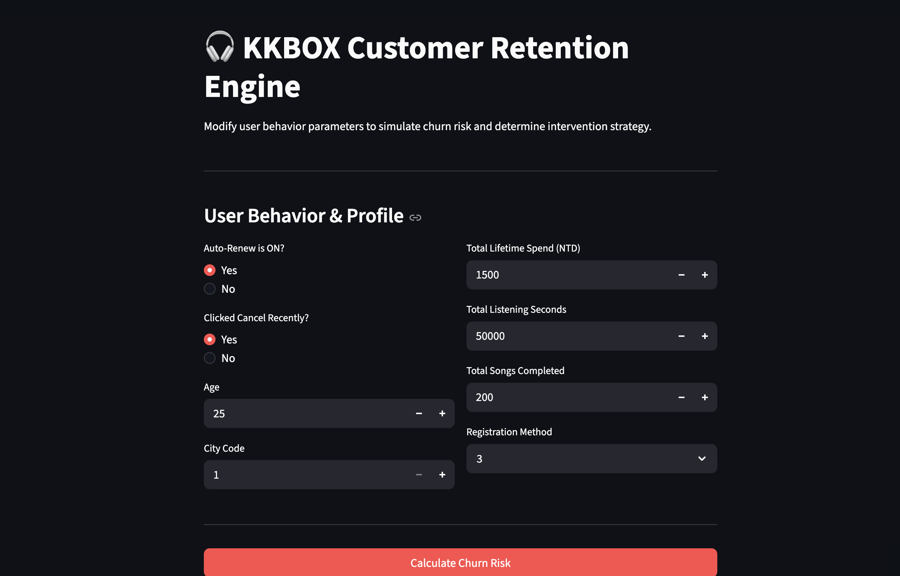

# 🎧 KKBOX Customer Retention Engine

An end-to-end Machine Learning pipeline and interactive dashboard designed to predict customer churn and simulate the financial impact of retention interventions. Built using the WSDM KKBOX Music Recommendation dataset.

[]

## 📊 Project Overview
Subscription businesses lose millions to passive and active churn. This project builds a predictive engine that identifies high-risk users *before* they cancel, allowing for targeted, cost-efficient interventions. 

The pipeline handles raw transactional data, engineers behavioral features, balances severe class disparities, and translates XGBoost model outputs into actionable business strategies using SHAP values.

## 🛠 Tech Stack
* **Data Engineering:** SQL, Pandas, NumPy
* **Machine Learning:** XGBoost, Scikit-Learn, Imbalanced-learn (SMOTE)
* **Interpretability:** SHAP (Game Theory feature importance)
* **Frontend Dashboard:** Streamlit

## 💡 Key Business Insights (SHAP Analysis)
1. **Passive Churn is the Primary Threat:** Users with `auto_renew = 0` are the highest risk cohort. A targeted campaign to incentivize auto-renew activation is the highest-ROI strategy.
2. **The "Zombie User" Paradox:** High lifetime spend coupled with extremely low recent listening time is a critical warning sign of impending churn, requiring immediate VIP intervention.
3. **Recall over Precision:** Given the low cost of a digital intervention (e.g., a discounted month), the model was optimized for **Recall (91%)** using `scale_pos_weight`, ensuring the widest possible net to catch actual churners, generating a simulated net positive value of +$2.2M monthly.

